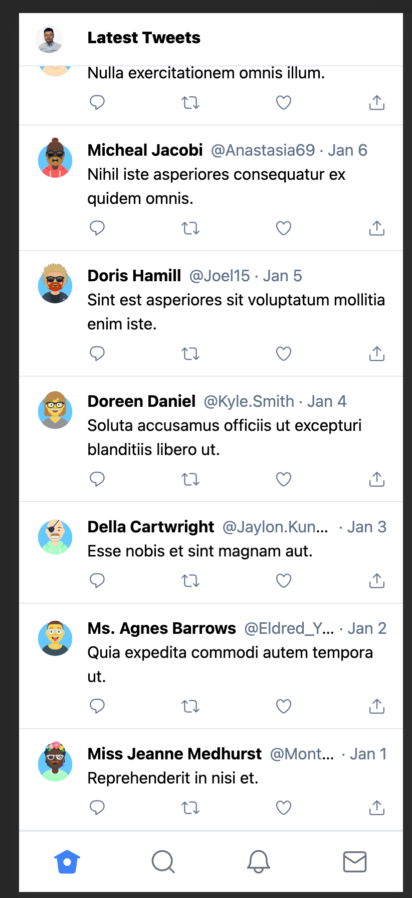

# Tweet Clone app with Next.js, Typescript, Tailwind css

## Overview

The ideas from [here](https://www.youtube.com/watch?v=Ra5SUzeXOac)
Router / SSG with [Next.js](https://nextjs.org/)
Written by Typescript
UI works with [Tailwind.css](https://tailwindcss.com/)

Working with randomly generated data from [Mirage,js](https://miragejs.com/) + [faker.js](https://github.com/Marak/Faker.js) + [random-avatar-generator](https://github.com/maiconfriedel/random-avatar-generator)

Get News articles from [News API](https://newsapi.org/)